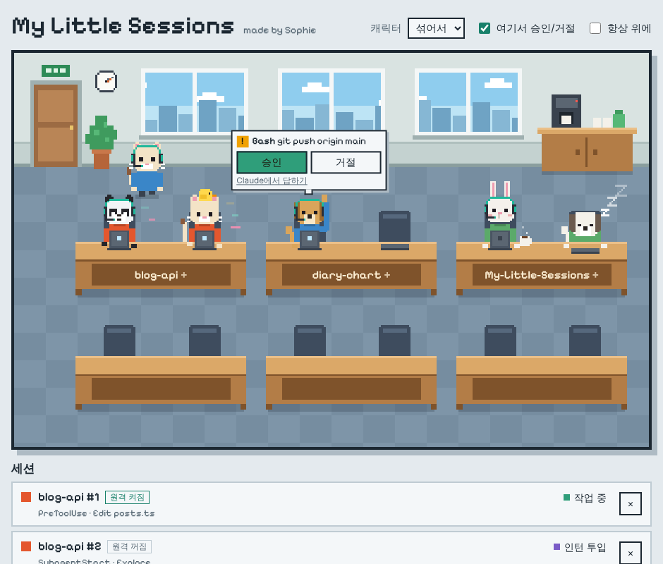

# My Little Sessions

[English](README.md) · **한국어**

Claude Code 세션을 위한 작은 픽셀아트 사무실이에요. 세션 하나가 직원 한 명이고, 같은 프로젝트끼리 한 책상에 모여 앉아요. Claude가 일하는 동안에는 타이핑하고, 내 입력을 기다릴 때는 커피를 마시고, 승인이 필요하면 손을 들어요. 말풍선에서 바로 승인하거나 거절할 수 있어요.

[](https://github.com/LetsBeLikeSophie/My-Little-Sessions/releases/latest/download/My-Little-Sessions-Setup.exe)
[](https://github.com/LetsBeLikeSophie/My-Little-Sessions/releases/latest/download/My-Little-Sessions-Portable.exe)



## 시작하기

1. 위 파일 중 하나를 받아서 실행해요. 설치 파일은 시작 메뉴에 등록되고, 무설치 exe는 설치 없이 바로 실행돼요.
2. 창에서 **Claude Code에 연결**을 눌러요. 이때 리모트 컨트롤을 켜 둔 세션은 원격 연결이 끊길 수 있어요. 끊기면 그 세션에서 `/remote-control`을 다시 실행하거나, 세션 위쪽의 리모트 컨트롤 아이콘을 눌러 다시 켜 주세요.
3. Claude Code를 평소처럼 쓰면 돼요. 세션이 다음에 움직일 때 문으로 걸어 들어와요.

코드 서명이 없는 앱이라 처음 실행할 때 "Windows의 PC 보호" 창이 뜰 수 있어요. **추가 정보 → 실행**을 누르면 돼요.

## 화면에서 보이는 것

| 사무실 모습 | 세션이 하고 있는 일 |
| --- | --- |
| 문에서 걸어 들어옴 | 세션이 시작됨 |
| 타이핑하고 코드 조각이 떠오름 | Claude가 프롬프트를 처리하거나 도구를 쓰는 중 |
| 병아리 인턴이 머리 위에 올라탐 | 서브에이전트가 실행 중 |
| 손을 들고 말풍선이 뜸 | 승인이 필요함 |
| 헤드셋을 쓰고 있음 | 그 세션의 리모트 컨트롤이 연결돼 있음 |
| 커피를 마심 | 내 입력을 기다리는 중이고, 리모트 컨트롤이 켜져 있음 |
| 책상에 엎드려 자고 z가 떠오름 | 내 입력을 기다리는 중이고, 리모트 컨트롤이 꺼져 있음 |
| 고개를 숙이고 빨간 ✕가 뜸 | API 오류로 턴이 끝남 |
| 문으로 걸어 나감 | 세션이 끝남 |

사무실이 알아서 하는 것도 있어요.

- **사무실은 항상 내 세션과 같아요.** 캐릭터가 알아서 들어오고, 바뀌고, 나가요. 앱을 다시 열면 있던 세션이 그대로 돌아와요.
- **같은 프로젝트 세션은 붙어 앉아요.** 프로젝트 이름이 적힌 긴 책상 하나를 같이 쓰고, 같은 색 옷을 입어요. 팀원이 오면 책상이 길어지고, 나가면 다시 좁혀 앉아요. 워크트리에서 도는 세션도 자기 프로젝트 책상에 앉아요.
- **책상 명패를 누르면 새 세션이 열려요.** 책상에 적힌 프로젝트 이름을 누르거나, 캐릭터를 누른 뒤 **여기에 새 세션**을 누르면 Claude 데스크톱 앱에서 그 프로젝트의 새 세션이 열려요. 새 팀원이 걸어 들어오고 책상이 자리를 내줘요.
- **벽시계와 창밖 하늘은 실제 시간을 따라가요.** 낮, 노을, 밤이 내 시간에 맞춰 바뀌어요.
- **캐릭터는 사람, 고양이, 강아지, 곰, 토끼, 또는 섞어서 고를 수 있어요.** 한 세션은 끝날 때까지 같은 모습이에요.
- **캐릭터를 누르면** 어느 폴더에서 일하는지 보이고, 자리를 치우는 버튼이 나와요. 리모트 컨트롤이 꺼져 있으면 `/remote-control`을 복사하는 버튼도 나와서, 그 세션에 붙여 넣기만 하면 돼요.
- **커피냐 잠이냐는 리모트 컨트롤로 갈려요.** 기다리는 세션 중 밖에서도 닿을 수 있는 세션은 커피를 마시며 깨어 있고, 닿을 수 없는 세션은 자요. 앱을 막 켜서 세션이 아직 소식을 보내기 전에는 5분 동안 커피를 마시다가 잠들어요.
- **헤드셋은 세션의 마지막 활동 기준이에요.** 세션이 가만히 있는 동안 리모트 컨트롤이 끊기면, 그 세션이 다음에 움직일 때 헤드셋을 벗어요.

## 사무실에서 승인하기

Claude가 승인을 요청하면 말풍선에 무엇을 하려는지(예: `Bash git push origin main`)와 **승인**, **거절** 버튼이 떠요. 긴 명령은 두 줄까지만 보이고, 글자를 누르면 전체가 펼쳐져요. 세션 목록에도 같은 버튼이 있어요.

- 말풍선이 떠 있는 동안 Claude Code는 최대 10분까지 답을 기다려요.
- **Claude에서 답하기**를 누르면 그 요청만 Claude Code로 돌려보내고, Claude Code가 직접 물어봐요.
- 구경만 하고 싶으면 **여기서 승인/거절**을 꺼요. 그러면 요청은 버튼 없는 말풍선으로만 보이고, 답은 Claude에서 해요.

## 동작 방식

My Little Sessions는 Claude Code가 세션 이벤트에 반응하는 용도로 문서화해 둔 확장 지점인 [훅(hooks)](https://code.claude.com/docs/en/hooks)을 사용해요. **Claude Code에 연결**을 누르면 사용자 설정 파일(`~/.claude/settings.json`)에 이벤트마다 작은 훅이 하나씩 추가돼요. 각 훅은 윈도우 10·11에 기본으로 들어 있는 `curl`로 이벤트를 `127.0.0.1:47821`의 앱에 보내요.

- **모든 것이 내 컴퓨터 안에만 있어요.** 앱은 로컬 주소에서만 듣고, 다른 곳으로는 아무것도 보내지 않아요.
- **기존 설정은 그대로예요.** 처음 바꾸기 전에 원래 파일을 `settings.json.before-my-little-sessions`로 복사해 두고, 다른 설정과 훅은 건드리지 않아요.
- **앱을 꺼도 Claude Code는 그대로 동작해요.** 앱이 꺼져 있으면 훅은 0.3초 만에 포기하고 아무것도 출력하지 않아요.
- 창 아래의 **연결 해제**를 누르면 훅을 다시 지워요.

알아 둘 점이 두 가지 있어요.

- 터미널을 강제로 닫았거나 앱이 꺼져 있는 동안 끝난 세션은 퇴근 인사를 못 해요. 그런 세션은 책상에서 잠들어요. **×** 버튼으로 자리를 치워 주세요. 그대로 두면 12시간 동안 조용할 때 스스로 나가요.
- 이 컴퓨터에서 도는 세션만 보여요. 클라우드 세션은 내 컴퓨터의 설정 파일을 읽지 않아요.

## 삭제하기

먼저 **연결 해제**를 누른 다음 윈도우 설정에서 제거해요(무설치 exe는 파일만 지우면 돼요). 앱을 이미 지웠다면 `~/.claude/settings.json`을 열어 `mls-hook`이 들어 있는 훅 항목을 지워 주세요.

## 소스에서 빌드하기

[Node.js](https://nodejs.org) 22 이상이 필요해요.

```bash
git clone https://github.com/LetsBeLikeSophie/My-Little-Sessions.git
cd My-Little-Sessions
npm install
npm start        # 데스크톱 앱 실행
npm test         # 테스트 실행
npm run dist     # dist/ 폴더에 윈도우 설치 파일과 무설치 exe 빌드
```

릴리스는 GitHub Actions가 윈도우에서 빌드해요. `v0.1.0` 같은 태그를 올리거나 Actions 탭에서 **Build** 워크플로를 직접 실행하면, 두 파일을 빌드해서 릴리스에 첨부해요.

macOS와 Linux에서도 `npm start`로 같은 창이 떠요. `npm run serve`는 창 없이 실행하고 브라우저로 열 주소를 출력해요.

## 만든 사람

[Sophie](https://github.com/LetsBeLikeSophie)가 만들었어요. 픽셀아트는 전부 코드로 그려서 따로 라이선스가 필요한 이미지가 없어요. 화면 글꼴은 [Pixelify Sans](https://github.com/eifetx/Pixelify-Sans)(SIL Open Font License)예요.

Claude Code를 쓰는 사람들을 위한 개인 취미 프로젝트이고, Anthropic이 만들었거나 Anthropic과 제휴한 것은 아니에요.

[MIT License](LICENSE)로 공개해요.
