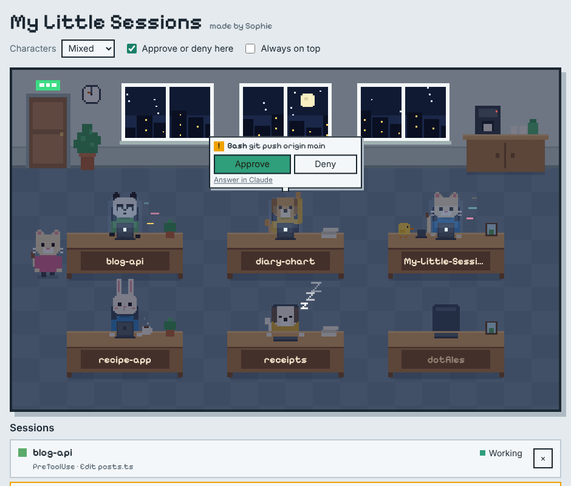

# My Little Sessions

**English** · [한국어](README.ko.md)

A tiny pixel-art office for your Claude Code sessions. Every session is a little employee at a desk: typing while Claude works, sipping coffee while it waits for you, and raising a hand when it needs permission. You can approve or deny right from the speech bubble.

[](https://github.com/LetsBeLikeSophie/My-Little-Sessions/releases/latest/download/My-Little-Sessions-Setup.exe)
[](https://github.com/LetsBeLikeSophie/My-Little-Sessions/releases/latest/download/My-Little-Sessions-Portable.exe)



## Get started

1. Download one of the files above and run it. The installer adds a Start menu entry; the portable exe runs without installing.
2. Click **Connect to Claude Code** in the window. Sessions that have Remote Control turned on may drop that connection at this moment; run `/remote-control` in the session again, or use the Remote Control icon at the top of the session, to turn it back on.
3. Use Claude Code as you always do. Each session walks in through the door the next time it does something.

Windows may show a "Windows protected your PC" notice because the app is not code-signed. Choose **More info → Run anyway**.

## What you see

| In the office | What the session is doing |
| --- | --- |
| Walks in from the door | The session started |
| Types, with bits of code floating up | Claude is working on your prompt or running a tool |
| A chick intern appears on the desk | A subagent is running |
| Raises a hand, with a speech bubble | Claude needs your permission |
| Sips coffee | Claude just finished and is waiting for you |
| Sleeps on the desk, with floating z's | Nothing has happened for 5 minutes |
| Slumps with a red ✕ | The turn ended with an API error |
| Walks out | The session ended |

A few more things the office does on its own:

- **The office always matches your sessions.** Characters arrive, change and leave on their own, and reopening the app brings back whoever was there.
- **Desks are added as you need them.** Three more appear whenever every desk is taken.
- **The wall clock and the sky outside follow your real time**, so the office goes through day, sunset and night with you.
- **Characters can be people, cats, dogs, bears, rabbits, or a mix.** A session keeps the same look for as long as it lives.
- **Clicking a character** shows which project folder it belongs to, with a button to clear its desk.

## Approving from the office

When Claude asks for permission, the bubble shows what it wants to do, for example `Bash git push origin main`, with **Approve** and **Deny**. Long commands are cut to two lines; click the text to read all of it. The same buttons are in the session list.

- Claude Code waits for your answer for up to 10 minutes while a bubble is open.
- **Answer in Claude** hands that one request back, and Claude Code asks you itself.
- Turn off **Approve or deny here** if you only want to watch. Requests then show up as bubbles without buttons, and you answer them in Claude.

## How it works

My Little Sessions uses [hooks](https://code.claude.com/docs/en/hooks), the extension point Claude Code documents for reacting to session events. **Connect to Claude Code** adds one small hook per event to your user settings file (`~/.claude/settings.json`). Each hook sends the event to the app on `127.0.0.1:47821` with `curl`, which ships with Windows 10 and 11.

- **Everything stays on your computer.** The app listens on the loopback address only, and nothing is sent anywhere else.
- **Your settings are kept.** The original file is copied to `settings.json.before-my-little-sessions` before the first change, and your other settings and hooks are left as they are.
- **Closing the app changes nothing in Claude Code.** The hooks give up after 0.3 seconds when the app is not running and never print anything.
- **Disconnect** in the footer removes the hooks again.

Two things to know:

- A session whose terminal was closed abruptly, or that ended while the app was closed, cannot say goodbye. It falls asleep at its desk. Clear the desk with the **×** button; otherwise it leaves on its own after 12 hours of silence.
- Only sessions on this computer show up. Cloud sessions do not read your local settings file.

## Uninstall

Click **Disconnect** first, then uninstall from Windows settings (or delete the portable exe). If the app is already gone, open `~/.claude/settings.json` and remove the hook entries that contain `mls-hook`.

## Build from source

You need [Node.js](https://nodejs.org) 22 or later.

```bash
git clone https://github.com/LetsBeLikeSophie/My-Little-Sessions.git
cd My-Little-Sessions
npm install
npm start        # run the desktop app
npm test         # run the tests
npm run dist     # build the Windows installer and portable exe into dist/
```

Releases are built by GitHub Actions on Windows. Pushing a tag such as `v0.1.0`, or starting the **Build** workflow by hand from the Actions tab, builds both files and attaches them to a release.

On macOS and Linux, `npm start` runs the same window. `npm run serve` runs it without a window and prints an address to open in a browser.

## Credits

Made by [Sophie](https://github.com/LetsBeLikeSophie). The pixel art is drawn in code, so there are no image assets to license. The interface font is [Pixelify Sans](https://github.com/eifetx/Pixelify-Sans) (SIL Open Font License).

This is an independent hobby project for people who use Claude Code. It is not made by or affiliated with Anthropic.

Released under the [MIT License](LICENSE).
